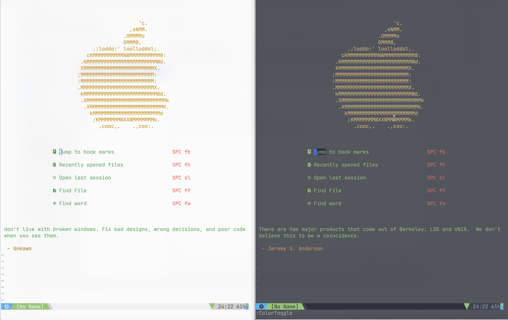
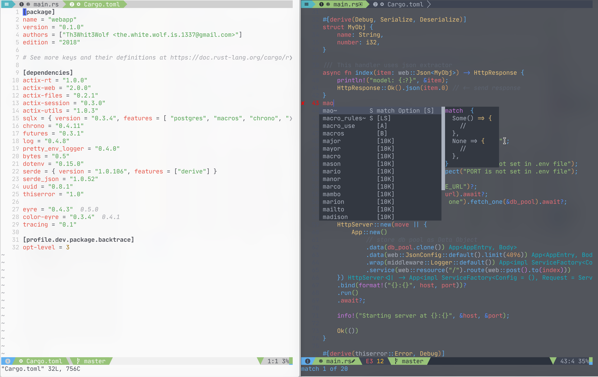

# Almost Finished Neovim Config

Fast and full featured neovim config that leans heavily on neovim's builtin package feature and
modular file structure. Lazy loading where it makes sense.

## Dev Focus

- Take full advantage of builting LSP
- Take full advantage of builting tree-sitter
- Take full advantage of lua based plugins
- Remove need for just to be installed
  - `plug.lua`, thanks to neopack can install plugins
  - `settings`, can create directories and install python virtualenv and lsp
  - Might create a `makefile` for update(or bake in that functionality)
- All neovim settings set in lua
- Put as much in lua as possible
- Stay fast & keep lazy loading
- More Custom plugins (in lua)
  - Async builder/compiler/transpiler, runner, tester
  - Async linter
  - Async formatter
  - Async (maybe incremental) tag generator (w/ [ptags](https://github.com/dalance/ptags))


<details>
  <summary>
    <strong>Table of Contents</strong>
    <small><i>(🔎 Click to expand/collapse)</i></small>
  </summary>

- [Almost Finished Neovim Config](#almost-finished-neovim-config)
  - [Features](#features)
  - [Screenshots](#screenshots)
  - [Prerequisites](#prerequisites)
  - [Install](#install)
  - [Upgrade](#upgrade)
    - [Recommended Fonts](#recommended-fonts)
      - [Terminals that support font ligatures](#terminals-that-support-font-ligatures)
      - [Why use ligatures](#why-use-ligatures)
    - [Recommended Tools](#recommended-tools)
  - [Structure](#structure)
  - [Plugin Highlights](#plugin-highlights)
  - [Features In-depth](#features-in-depth)
    - [Auto Shebang](#auto-shebang)
      - [Shebangs](#shebangs)
    - [Code Compile](#code-compile)
    - [Code Runner](#code-runner)
    - [Code Tester](#code-tester)
  - [Plugins Included](#plugins-included)
    - [Non Lazy-Loaded Plugins](#non-lazy-loaded-plugins)
    - [Lazy-Loaded Plugins](#lazy-loaded-plugins)
      - [Language](#language)
      - [Interface](#interface)
      - [Completion & Code-Analysis](#completion--code-analysis)
      - [Command](#command)
  - [Custom Mappings](#custom-mappings)
    - [Leader Key Mappings](#leader-key-mappings)
      - [Navigation](#navigation)
      - [File Operations](#file-operations)
      - [Edit](#edit)
      - [Search & Replace](#search--replace)
      - [Clipboard](#clipboard)
      - [Command & History](#command--history)
      - [Editory UI](#editory-ui)
      - [Custom Tools & Plugins](#custom-tools--plugins)
      - [Window Management](#window-management)
      - [Git Version Control](#git-version-control)
  - [Credits](#credits)

</details>

## Features

- Fast startup time, 27-40ms (much slower right now 62[nvim]-100[nvim <file>]ms)
- Robust, yet light-weight
- Lazy Load 96% of plugins (202/211)
- Ultimate Linting, Code Formating, & Language Support
- Central location for tags
- Awesome Dashboard(thanks to [dashboard.nvim](https://github.com/hardcoreplayers/dashboard-nvim/blob/master/plugin/dashboard.vim))
- Auto Shebang
- Shebang Filetype Detection
- Code Runner, Compiler, & Tester
- Lazygit integration
- Light & Dark Mode
- Automatically changes colors at night
- Automatically adds in pairs (parentheses, brackets, curly brace) and ends
- (end, endif, fi, etc)
- Automatically format code on save

## Screenshots

**NOTE:** My desktop dims inactive window, light theme is actually lighter





## Prerequisites

- Python 3
- Rust (curl --proto '=https' --tlsv1.2 -sSf https://sh.rustup.rs | sh)
- Neovim
- git
- yarn (for vim-jsdoc)
- Your Compiler and/or Interpreter
- Your favorite Language Servers, Linters, and/or Code Formatters

## Install

[1.] Let's clone this repo! Clone to `~/.config/nvim`

```sh
mkdir ~/.config
git clone https://github.com/Th3Whit3Wolf/Almost-Finished-Neovim-Config.git ~/.config/nvim -c "lua plug.install_default()" -c "qa"
```

[1.] Run `nvim` so that:

- Plugins get installed
- Python virtualenv & lsp are set up
- Create swap, backup, session, tags, and undo directories
- Install all tree-sitter files

[1.] Install extensions from below to get better autocompletion and linting

Enjoy!

## Upgrade

Might add a `Makefile` to update

### Recommended Fonts

| Ligature Fonts    | No Ligatures but Awesome |
| ----------------- | ------------------------ |
| [Fira Code](https://github.com/tonsky/FiraCode) (free) |  [IBM Plex Mono](https://github.com/IBM/plex) (free) |
| [Hasklig](https://github.com/i-tu/Hasklig) (free) | [Hack](https://sourcefoundry.org/hack/) (free)** |
| [PragmataPro](http://www.fsd.it/fonts/pragmatapro.htm) (€59) | [Source Code Pro](https://adobe-fonts.github.io/source-code-pro/) (free) |
| [Monoid](http://larsenwork.com/monoid/) (free) | [Menlo](https://www.typewolf.com/site-of-the-day/fonts/menlo) (free)     |
| [Fixedsys Excelsior](https://github.com/kika/fixedsys) (free) | [Monaco](https://gist.github.com/rogerleite/99819) (free)    |
| [Iosevka](https://be5invis.github.io/Iosevka/) (free) |     |
| [DejaVu Sans Code](https://github.com/SSNikolaevich/DejaVuSansCode) (free) |        |
| [JetBrains Mono](https://github.com/JetBrains/JetBrainsMono) | |

#### Terminals that support font ligatures

| Works              | Doesn’t work       |
| ------------------ | ------------------ |
| Butterfly      | Alacritty      |
| Hyper.app      | cmd.exe        |
| iTerm 2 ([since 3.1](https://gitlab.com/gnachman/iterm2/issues/3568#note_13118332)) | Cmder |
| Kitty          | ConEmu         |
| Konsole        | GNOME Terminal |
| QTerminal      | mate-terminal  |
| Terminal.app   | mintty         |
| Termux         | PuTTY          |
| Token2Shell/MD | rxvt           |
| upterm         | ZOC (Windows)  |
| ZOC (macOS)    | libvte-based terminals ([bug report](https://bugzilla.gnome.org/show_bug.cgi?id=584160)) |

#### Why use ligatures

So This..


Looks Like This


### Recommended Tools

* [ripgrep](https://github.com/BurntSushi/ripgrep)

  * Faster grepping (also used by vim-clap)

* [fzy](https://github.com/jhawthorn/fzy)

  * Used by vim-claps

* [sk](https://github.com/lotabout/skim)

  * Used by vim-clap

* [fd](https://github.com/sharkdp/fd)

  * Used by vim-clap

* [Universal ctags](https://ctags.io/)
  * for syntax tokenization

- [LazyGit](https://github.com/jesseduffield/lazygit)

  - Simple terminal UI for git commands
  - Makes using git insanely easy

- [zoxide](https://github.com/ajeetdsouza/zoxide)
  - zoxide is a blazing fast alternative to cd, inspired by z and z.lua.
  - It keeps track of the directories you use most frequently, and uses a ranking algorithm to navigate to the best match.

## Structure

Changes too much to add in here

## Plugin Highlights

- Plugin managed outside of vim (can automate plugin updates) and lazy loading for speed
- Auto-completion with Language-Server Protocol (LSP)
- Code Compiler, Runner, & Tester builtin
- Coc-Explorer as file-manager

## Features In-depth

<details open>
  <summary><strong>List</strong> <small><i>(🔎 Click to expand/collapse)</i></small></summary>

### Auto Shebang

When creating a new shell or python script neovim will prompt you for what shebang you would like to use. This is automatic for awk, escript, fish, ion, julia, lua, perl, php, ruby, and scala.

You can press <kbd>space</kbd>+<kbd>cs</kbd> to change shebangs

#### Shebangs

**Awk**

`#!/usr/bin/env awk`

**Escript**

`#!/usr/bin/env escript`

**Fish**

`#!/usr/bin/env fish`

**Ion**

`#!/usr/bin/env ion`

**Julia**

`#!/usr/bin/env julia`

**Lua**

`#!/usr/bin/env lua`

**Perl**

`#!/usr/bin/env perl`

**PHP**

`#!/usr/bin/env php`

**Python**

- python2 - `#!/usr/bin/env python2`
- python3 - `#!/usr/bin/env python2`
- pypy     - `#!/usr/bin/env pypy`
- pypy3    - `#!/usr/bin/env pypy3`
- jython  - `#!/usr/bin/env jython`

**Ruby**

`#!/usr/bin/env ruby`

**Scala**

`#!/usr/bin/env scala`

**Shell**

- ash    - `#!/usr/bin/env ash`
- bash   - `#!/usr/bin/env bash`
- csh    - `#!/usr/bin/env csh`
- dash   - `#!/usr/bin/env dash`
- fish   - `#!/usr/bin/env fish`
- ksh    - `#!/usr/bin/env ksh`
- ion    - `#!/usr/bin/env ion`
- mksh   - `#!/usr/bin/env mksh`
- pdksh  - `#!/usr/bin/env pdksh`
- tcsh   - `#!/usr/bin/env tcsh`
- zsh    - `#!/usr/bin/env zsh`

### Code Compile

| Language | Requirements | Action |
| -------- | ------------ | ------ |
| C     | gcc | Compiles binary to filename without extensions |
| C++     | g++ | Compiles binary to filename without extensions |
| Go     | go | Runs go build |

### Code Runner

| Language | Requirements | Action |
| -------- | ------------ | ------ |
| C        | gcc | Compiles binary and executes |
| C++      | g++ | Compiles binary and executes |
| Go       | go | Runs go run |

### Code Tester

| Language | Requirements | Action |
| -------- | ------------ | ------ |
| Rust     | Inside of Cargo Project | Runs test with one thread and shows output of test |

</details>

