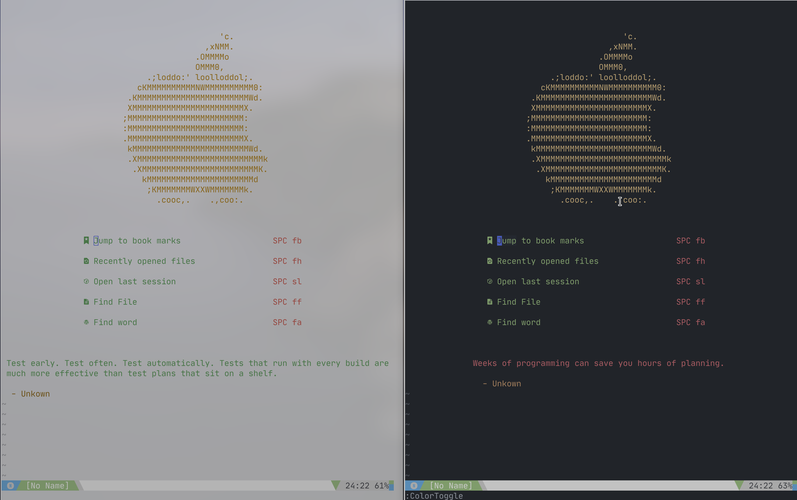

# Almost Finished Neovim Config

Full feature vim config to look good on my MateBook X Pro (macbook clone) with a convincingly Mac UI

## Features

* Lazy Load 50% of plugins (15/30)
* Ultimate Linting, Code Formating, & Language Support
* Central location for tags
* Awesome Startpage(thanks to [dashboard.nvim](https://github.com/hardcoreplayers/dashboard-nvim/blob/master/plugin/dashboard.vim))
* Auto Shebang
* Code Runner & Compiler
* Can determine filetype for files with no extensions(via shebang)
* Lazygit integration
* Light & Dark Mode
* Automatically changes colors at night

## Screenshots

###### **NOTE:** My desktop dims inactive window, light theme is actually lighter




### Pre-Requisites

* Python 3
* Rust (curl --proto '=https' --tlsv1.2 -sSf https://sh.rustup.rs | sh)
* Neovim
* Just
* yarn (for coc.vim)
* Your Compiler and/or Interpreter
* Your favorite Language Servers, Linters, Code Formatters

## Install

[1.] Let's clone this repo! Clone to `~/.config/nvim`,
we'll also symlink it for Vim:

```sh
mkdir ~/.config
git clone https://github.com/Th3Whit3Wolf/Almost-Finished-Neovim-Config.git ~/.config/nvim
cd ~/.config/nvim
ln -s ~/.config/nvim ~/.vim  # For Vim8, although no promises on this working with vim
just install
```

If you do web development you may also want to run `just web` for linters, formatters, and spell checker.

* _**Note:**_ If your system sets `$XDG_CONFIG_HOME`,
  use that instead of `~/.config` in the code above.
  Nvim follows the XDG base-directories convention.

[1.] Install extensions from below to get better autocompletion and linting

Enjoy!

### Recommended Fonts

| Ligature Fonts    | No Ligatures but Awesome |
| ----------------- | ------------------------ |
| [Fira Code](https://github.com/tonsky/FiraCode) (free) |  [IBM Plex Mono](https://github.com/IBM/plex) (free) |
| [Hasklig](https://github.com/i-tu/Hasklig) (free) | [Hack](https://sourcefoundry.org/hack/) (free)** |
| [PragmataPro](http://www.fsd.it/fonts/pragmatapro.htm) (€59) | [Source Code Pro](https://adobe-fonts.github.io/source-code-pro/) (free) |
| [Monoid](http://larsenwork.com/monoid/) (free) | [Menlo](https://www.typewolf.com/site-of-the-day/fonts/menlo) (free)     |
| [Fixedsys Excelsior](https://github.com/kika/fixedsys) (free) | [Monaco](https://gist.github.com/rogerleite/99819) (free)    |
| [Iosevka](https://be5invis.github.io/Iosevka/) (free) |     |
| [DejaVu Sans Code](https://github.com/SSNikolaevich/DejaVuSansCode) (free) |        |
| [JetBrains Mono](https://github.com/JetBrains/JetBrainsMono) | |

#### Terminals that support font ligatures

| Works              | Doesn’t work       |
| ------------------ | ------------------ |
| Butterfly      | Alacritty      |
| Hyper.app      | cmd.exe        |
| iTerm 2 ([since 3.1](https://gitlab.com/gnachman/iterm2/issues/3568#note_13118332)) | Cmder |
| Kitty          | ConEmu         |
| Konsole        | GNOME Terminal |
| QTerminal      | mate-terminal  |
| Terminal.app   | mintty         |
| Termux         | PuTTY          |
| Token2Shell/MD | rxvt           |
| upterm         | ZOC (Windows)  |
| ZOC (macOS)    | libvte-based terminals ([bug report](https://bugzilla.gnome.org/show_bug.cgi?id=584160)) |

#### Why use ligatures

So This..


Looks Like This


### Recommended Tools

* [ripgrep](https://github.com/BurntSushi/ripgrep)

  * Faster grepping (also used by vim-clap)

* [fzy](https://github.com/jhawthorn/fzy)

  * Used by vim-clap

* [sk](https://github.com/lotabout/skim)

  * Used by vim-clap

* [fd](https://github.com/sharkdp/fd)

  * Used by vim-clap

* [Universal ctags](https://ctags.io/)

  * for syntax tokenization

* [Lazy Git](https://github.com/jesseduffield/lazygit)

  * Simple terminal UI for git commands

  * Makes using git insanely easy

## Upgrade

```sh
just upgrade
```

## Features In-depth

### Auto Shebang

When creating a new shell or python (neo)vim will prompt you for what shebang you would like to use. It is automatic for escript, fish, ion, lua, perl, php, & ruby.

You can press <kbd>F6</kbd> to change shebangs

#### Shebangs

**Escript**

`#!/usr/bin/env escript`

**Fish**

`#!/usr/bin/env fish`

**Ion**

`#!/usr/bin/env ion`

**Lua**

`#!/usr/bin/env lua`

**Perl**

`#!/usr/bin/env perl`

**PHP**

`#!/usr/bin/env php`

**Python**

* python2 - `#!/usr/bin/env python2`
* python3 - `#!/usr/bin/env python2`
* ypy     - `#!/usr/bin/env pypy`
* ypy3    - `#!/usr/bin/env pypy3`
* jython  - `#!/usr/bin/env jython`

**Ruby**

`#!/usr/bin/env ruby`

**Shell**

* ash   - `#!/usr/bin/env ash`
* bash  - `#!/usr/bin/env bash`
* csh   - `#!/usr/bin/env csh`
* dash  - `#!/usr/bin/env dash`
* fish  - `#!/usr/bin/env fish`
* ksh   - `#!/usr/bin/env ksh`
* ion   - `#!/usr/bin/env ion`
* mksh  - `#!/usr/bin/env mksh`
* dksh  - `#!/usr/bin/env pdksh`
* tcsh  - `#!/usr/bin/env tcsh`
* zsh   - `#!/usr/bin/env zsh`

## Custom Mappings

### Leader Key Mappings

| Key                                  | Action       |
| ------------------------------------ | ------------ |
| Space</kbd>                          | Leader       |
| Space</kbd>+<kbd>g</kbd><kbd>m</kbd> | GitMessenger |

Plus a lot more

## Credits

I owe a specail thanks to the following projects:

* [Pack](https://github.com/maralla/pack) - Package Manager that works outside of vim

  * This config is designed to utilize neovim even though this package manager doesn't support neovim. This package manger is being used as a utility to install and update packages. This config utilizes (neo)vim's builtin plugin runtime management to load plugin(mostly lazily).

* [Coc](https://github.com/neoclide/coc.nvim) - Intellisense engine for vim8 & neovim, full language server protocol support as VSCode

* [Vim Buffet](https://github.com/bagrat/vim-buffet) and [Spaceline](https://github.com/hardcoreplayers/spaceline.vim) - Provide an IDE-like Vim tabline & vim statusline like spacemacs 

  * Provides beautiful UI

* [Vim Clap](https://github.com/liuchengxu/vim-clap) - Modern generic interactive finder and dispatcher for Vim and NeoVim

  * Extraordinarily fast interactive finder and dispatcher
